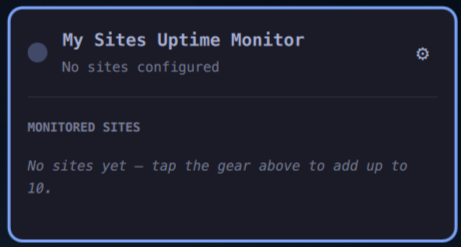
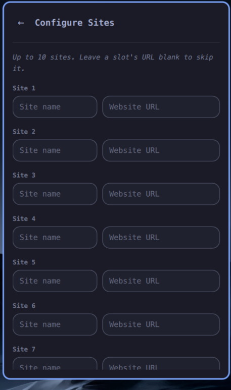

# My Sites Uptime Monitor

An [Omarchy](https://omarchy.org/) bar plugin that checks up to 10 website URLs
and shows a status dot in the top bar:

- 🟢 **green** — every configured website returns a successful HTTP response.
- 🔴 **red** — one or more configured websites fail their HTTP check.
- ⚪ **grey** — nothing is configured yet, or the first check has not completed.

Click the dot to open the live status list. Click the gear in the top-right
corner to open the configuration page.

## Screenshots

| Status list | Configuration |
| --- | --- |
|  |  |

## Features

- Up to 10 monitored websites, each with a **name** and a **URL**.
- A slot with a blank URL is skipped entirely.
- Checks run automatically every 30 minutes, immediately after saving changes,
  and whenever you press **Check now**.
- Follows HTTP redirects.
- Treats connection failures, timeouts, and HTTP 400–599 responses as down.
- Sends a critical Omarchy desktop notification when an outage is first
  detected. The alert includes the site name, URL, and local date and time.
- Does not repeat the alert every 30 minutes while the same site remains down.
  After recovery, a later outage sends a new notification.
- Keeps the live status list and the 10-slot settings editor on separate pages.

## Installation

```bash
omarchy plugin add https://github.com/elchacoveloz/my-sites-uptime-monitor.git --enable --yes
```

Or install it manually:

```bash
git clone https://github.com/elchacoveloz/my-sites-uptime-monitor.git \
  ~/.config/omarchy/plugins/iserrano.sites-uptime-monitor
omarchy-shell shell rescanPlugins
omarchy plugin enable iserrano.sites-uptime-monitor
```

The widget is placed in the bar's right section by default. Move it with:

```bash
omarchy bar move iserrano.sites-uptime-monitor --section <left|center|right>
```

## Uninstallation

Remove the plugin and unload it from Omarchy Shell:

```bash
omarchy plugin remove iserrano.sites-uptime-monitor --yes
```

The removal command leaves your saved site configuration in place. To delete
it as well:

```bash
rm -f ~/.local/state/omarchy/settings/sites-uptime-monitor.json
```

## How checks work

Each configured URL is checked with `curl` using a normal HTTP GET request:

```bash
curl --silent --show-error --location --fail --output /dev/null \
  --connect-timeout 5 --max-time 10 <url>
```

A zero exit code marks the site as **Up**. Any other exit code marks it as
**Down**. This checks the website itself rather than relying on ICMP ping.

Enter complete URLs including the scheme, for example:

```text
https://example.com
```

## Configuration storage

Site configuration lives outside `shell.json` in its own state file:

`~/.local/state/omarchy/settings/sites-uptime-monitor.json`

```json
{
  "sites": [
    { "name": "Example", "url": "https://example.com" },
    { "name": "", "url": "" },
    { "name": "", "url": "" },
    { "name": "", "url": "" },
    { "name": "", "url": "" },
    { "name": "", "url": "" },
    { "name": "", "url": "" },
    { "name": "", "url": "" },
    { "name": "", "url": "" },
    { "name": "", "url": "" }
  ]
}
```

You can also edit this file directly; the panel picks up changes live.

## License

MIT — see [LICENSE](LICENSE).
